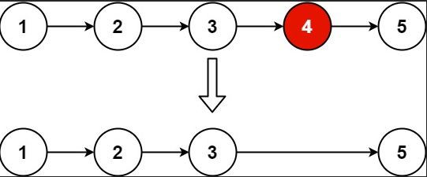

# 19. Remove Nth Node From End of List

## Problem Link
[Problem](https://leetcode.com/problems/remove-nth-node-from-end-of-list/description/)

## Problem Description
Given the head of a linked list, remove the nth node from the end of the list and return its head.




### WAY 1:
```
/**
 * Definition for singly-linked list.
 * struct ListNode {
 *     int val;
 *     ListNode *next;
 *     ListNode() : val(0), next(nullptr) {}
 *     ListNode(int x) : val(x), next(nullptr) {}
 *     ListNode(int x, ListNode *next) : val(x), next(next) {}
 * };
 */
class Solution {
public:
    ListNode* removeNthFromEnd(ListNode* head, int n) {
        ListNode* dummy = new ListNode(0, head);
        ListNode* cur = head;
        ListNode* pre = dummy;
        
        if (head -> next == nullptr)
            return head -> next; 

        int length = 0;
        while (cur != nullptr) 
        {
            length++;
            cur = cur->next;
        }
        cur = head;
        int nth = length - n;

        while (nth != 0)
        {
            cur = cur -> next;
            pre = pre -> next;
            nth--;
        }  
        pre -> next = cur -> next;

        delete cur;
        return dummy -> next; 
    }
};
```
* N：Link List 的長度(1 <= n <= 30)
* Time Complexity $O(2N) = O(N)$

### WAY 2:
* 利用兩個指標之間保持固定的「距離」，當前面的指標走到終點時，後面的指標剛好就會停在我們需要的位置
```
class Solution {
public:
    ListNode* removeNthFromEnd(ListNode* head, int n) {
        ListNode* res = new ListNode(0, head);
        ListNode* dummy = res;

        while (head != nullptr && n--)
            head = head->next;

        while (head != nullptr) 
        {
            head = head->next;
            dummy = dummy->next;
        }

        dummy->next = dummy->next->next;

        return res->next;      
    }
};
```
