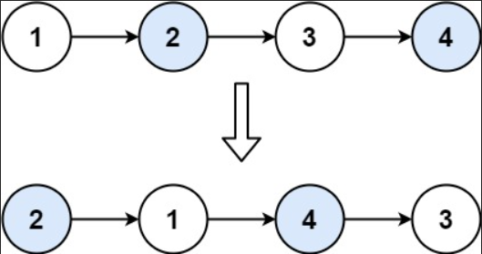

# 24. Swap Nodes in Pairs


## Problem Link
[Problem](https://leetcode.com/problems/swap-nodes-in-pairs/description/)

## Problem Description
Given a linked list, swap every two adjacent nodes and return its head. You must solve the problem without modifying the values in the list's nodes (i.e., only nodes themselves may be changed.)



### WAY 1:
```
/**
 * Definition for singly-linked list.
 * struct ListNode {
 *     int val;
 *     ListNode *next;
 *     ListNode() : val(0), next(nullptr) {}
 *     ListNode(int x) : val(x), next(nullptr) {}
 *     ListNode(int x, ListNode *next) : val(x), next(next) {}
 * };
 */
class Solution {
public:
    ListNode* swapPairs(ListNode* head) {
        if (head == nullptr || head -> next == nullptr)
            return head;

        ListNode* dummy = new ListNode(0, head);
        ListNode* cur = head;
        ListNode* prev = dummy;

        while (cur != nullptr && cur -> next != nullptr)
        {
            ListNode* tmp = cur -> next;
            cur -> next = tmp -> next;
            tmp -> next = cur;
            prev -> next = tmp;
            prev = cur;
            cur = cur -> next;
        }
        return dummy -> next;
    }
};
```
* Time Complexity $O(N)$
* Space Complexity $O(1)$