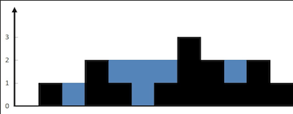

# 42. Trapping Rain Water

## Problem Link
[Problem]()

## Problem Description
Given n non-negative integers representing an elevation map where the width of each bar is 1, compute how much water it can trap after raining.




### WAY 1:
```
class Solution {
public:
    int trap(vector<int>& height) {
        int n = height.size();
        vector<int> pre_max(height.size(), 0);
        vector<int> suf_max(height.size(), 0);

        pre_max[0] = height[0];
        for (int i=1; i<n; i++)
            pre_max[i] = max(pre_max[i-1], height[i]);

        suf_max[n-1] = height[n-1];
        for (int i=n-2; i>=0; i--)
            suf_max[i] = max(suf_max[i+1], height[i]);

        int total_rain = 0;
        for (int i=0; i<n; i++)
            total_rain += min(pre_max[i], suf_max[i]) - height[i];

        return total_rain;
    }
};
```
* N：height 的長度(1 <= n <= 2 * 104)
* Time Complexity $O(3N) = O(N)$
* Space Complexity $O(2N) = O(N)$


### WAY 2:
* 可以將空間複雜度下降至 1 (未完成)