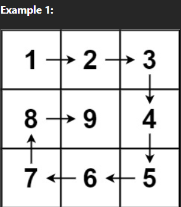

# 242. Valid Anagram

## Problem Link
[Problem](https://leetcode.com/problems/spiral-matrix-ii/description/)

## Problem Description
Given a positive integer n, generate an n x n matrix filled with elements from 1 to n2 in spiral order.



### WAY 1:
```
class Solution {
public:
    vector<vector<int>> generateMatrix(int n) {
        vector<vector<int>> output(n, vector<int>(n));
        
        int cnt = 1;
        for (int i=0; i<(n+1)/2; i++)
        {
            for (int j=i; j<n-i; j++)
                output[i][j] = cnt++;

            for (int j=i+1; j<(n-i); j++)
                output[j][n-i-1] = cnt++;

            for (int j=n-i-2; j>=i; j--)
                output[n-i-1][j] = cnt++;

            for (int j=n-i-2; j>=i+1; j--)
                output[j][i] = cnt++;
        }
        return output;
    }
};
```

