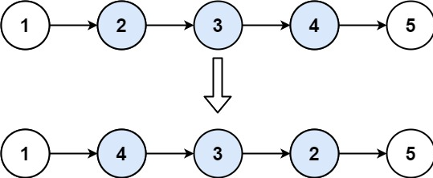

# 92. Reverse Linked List II


## Problem Link
[Problem](https://leetcode.com/problems/reverse-linked-list-ii/)

## Problem Description
Given the head of a singly linked list and two integers left and right where left <= right, reverse the nodes of the list from position left to position right, and return the reversed list.



### WAY 1:
```
/**
 * Definition for singly-linked list.
 * struct ListNode {
 *     int val;
 *     ListNode *next;
 *     ListNode() : val(0), next(nullptr) {}
 *     ListNode(int x) : val(x), next(nullptr) {}
 *     ListNode(int x, ListNode *next) : val(x), next(next) {}
 * };
 */
class Solution {
public:
    ListNode* reverseBetween(ListNode* head, int left, int right) {
        ListNode* dummy = new ListNode(0, head);
        ListNode* pre = dummy;  

        int i=1;
        while (i < left)
        {
            pre = pre -> next;
            i++;
        }                        // i = left - 1

        ListNode* cur = pre -> next;

        while (i < right)
        {
            ListNode* tmp = cur -> next;
            cur->next = tmp->next;
            tmp->next = pre->next;
            pre->next = tmp;
            i++;
        }

        return dummy -> next;
    }
};
```
* N：List 的長度 (1 <= n <= 500)
* Time Complexity $O(N)$
* Space Complexity $O(1)$