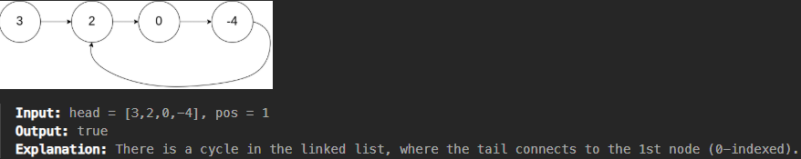

# 141. Linked List Cycle


## Problem Link
[Problem](https://leetcode.com/problems/linked-list-cycle/description/)

## Problem Description
Given head, the head of a linked list, determine if the linked list has a cycle in it.

There is a cycle in a linked list if there is some node in the list that can be reached again by continuously following the next pointer. Internally, pos is used to denote the index of the node that tail's next pointer is connected to. Note that pos is not passed as a parameter.

Return true if there is a cycle in the linked list. Otherwise, return false.




### WAY 1:
```
class Solution {
public:
    bool hasCycle(ListNode *head) {
        ListNode* first = head;
        ListNode* second = head;

        while (first != nullptr && first -> next != nullptr)
        {
            first = first -> next -> next;
            second = second -> next;

            if (first == second)
                return true;
        }

        return false;
    }
};
```
* n：list node 個數 ([0, 104])
* Time Complexity $O(n)$
* Space Complexity $O(1)$

