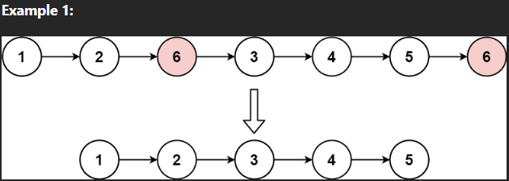

# 203. Remove Linked List Elements

## Problem Link
[Problem](https://leetcode.com/problems/remove-linked-list-elements/description/)

## Problem Description
Given the head of a linked list and an integer val, remove all the nodes of the linked list that has Node.val == val, and return the new head.



### WAY 1:
* Time Complexity O(n), n : ListNode.length()
```
/**
 * Definition for singly-linked list.
 * struct ListNode {
 *     int val;
 *     ListNode *next;
 *     ListNode() : val(0), next(nullptr) {}
 *     ListNode(int x) : val(x), next(nullptr) {}
 *     ListNode(int x, ListNode *next) : val(x), next(next) {}
 * };
 */
class Solution {
public:
    ListNode* removeElements(ListNode* head, int val) {
        ListNode* output = new ListNode(0, head);
        ListNode* dummy = output;

        while (dummy != nullptr)
        {
            while (dummy -> next != nullptr && (dummy -> next -> val == val) )
            {
                ListNode* tmp = dummy -> next;
                dummy -> next = dummy -> next -> next;
                delete tmp;
            }
            dummy = dummy -> next;
        }

        ListNode* ans = output -> next;
        delete output;

        return ans;
    }
};
```

