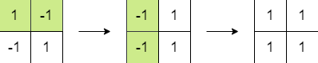
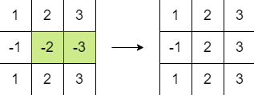

# 1975. Maximum Matrix Sum

## Problem Link
[Problem](https://leetcode.com/problems/maximum-matrix-sum/description/?envType=daily-question&envId=2026-01-04)

## Problem Description
You are given an n x n integer matrix. You can do the following operation any number of times:

* Choose any two adjacent elements of matrix and multiply each of them by -1.
Two elements are considered adjacent if and only if they share a border.

Your goal is to maximize the summation of the matrix's elements. Return the maximum sum of the matrix's elements using the operation mentioned above.

Given bottom and allowed, return true if you can build the pyramid all the way to the top such that every triangular pattern in the pyramid is in allowed, or false otherwise.




### WAY 1:
```
class Solution {
public:
    long long maxMatrixSum(vector<vector<int>>& matrix) {
        ios_base::sync_with_stdio(0);
        cin.tie(0);
        cout.tie(0);

        // vector<int> Nagative_ele;
        bool check_zero = false;
        long int sum = 0;
        int min_pos = 10e6;
        int max_nag = -10e6;
        int cnt_nag = 0;
        // N * N
        for (int i=0; i<matrix.size(); i++)
        {
            for (int j=0; j<matrix[0].size(); j++)
            {
                sum += abs(matrix[i][j]);
                if (matrix[i][j] < 0)
                {
                    max_nag = max(max_nag, matrix[i][j]);
                    cnt_nag ++;
                }
                else if (matrix[i][j] == 0)
                    check_zero = true;
                else
                    min_pos = min(min_pos, matrix[i][j]);
            }
        } 

        if (max_nag == -10e6)
            return sum;

        if (cnt_nag % 2 == 0 || check_zero)
            return sum;
        else
        {
            if (-1 * max_nag >= min_pos)
                sum -= 2 * min_pos;
            else
                sum += 2 * max_nag;
        }
        return sum;
    }
};
```
* n == matrix.length == matrix[i].length
* N：陣列大小 (2 <= n <= 250)
* Time Complexity $O(N^2)$